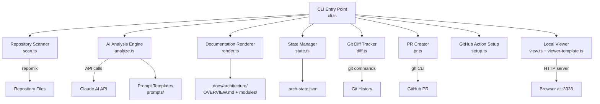
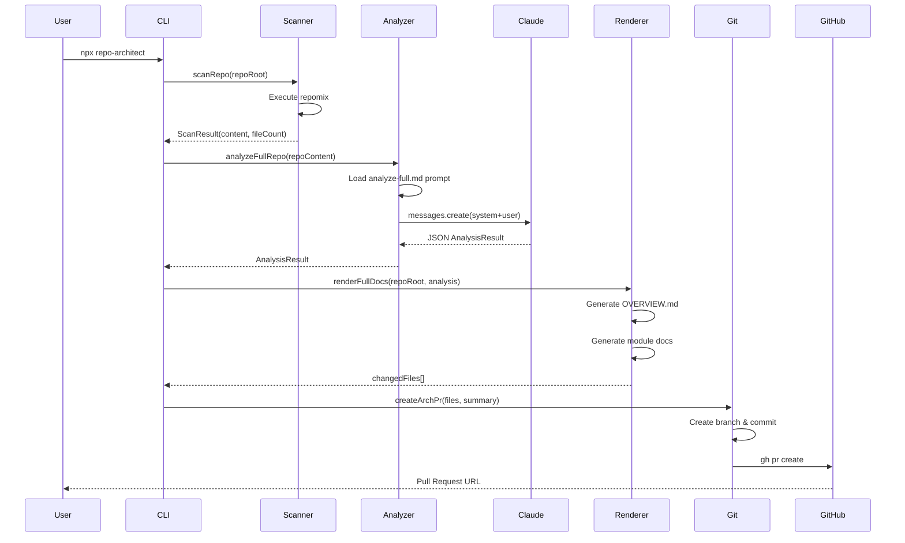
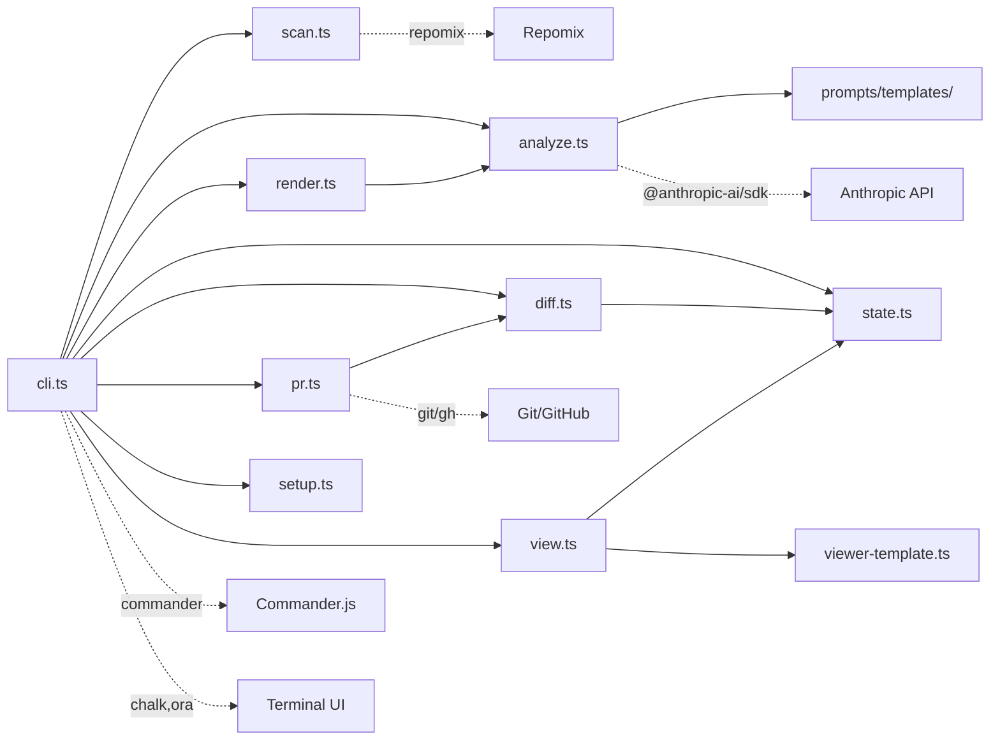

# repo-architect - Architecture Overview

> Auto-generated by repo-architect on 2026-02-17

## Overview

repo-architect is an automated architecture documentation generator that leverages Claude AI to analyze codebases and produce comprehensive, living documentation. The tool scans repositories, identifies architectural patterns, and generates Markdown documentation with Mermaid diagrams including system maps, data flows, dependency graphs, and per-module details.

The system operates in two modes: full analysis for initial documentation and incremental updates that only regenerate docs when structural changes are detected. It integrates with GitHub Actions for nightly documentation updates and includes a local web viewer for interactive diagram exploration.

The architecture follows a clear pipeline pattern: scan → analyze → render → PR. The scan phase uses repomix to extract repository content, the analyze phase sends this to Claude AI for structural analysis, the render phase generates Markdown files with Mermaid diagrams, and the optional PR phase creates a pull request with the updated documentation. State management tracks the last analysis to enable efficient incremental updates.

## Tech Stack

- TypeScript (ES2022)
- Bun runtime
- Node.js APIs (fs, http, child_process)
- Anthropic Claude API (@anthropic-ai/sdk)
- repomix (repository scanning)
- Commander.js (CLI)
- Mermaid (diagram generation)
- GitHub CLI (gh)
- Git
- Vitest (testing)
- Cloudflare Workers (homepage hosting)

## System Map

## Data Flows

## Dependency Graph

## Modules

| Module | Path | Description |
|--------|------|-------------|
| [CLI Entry Point](modules/cli-entry-point.md) | `src/cli.ts` | Main command-line interface that orchestrates the entire documentation pipeline. Handles argument parsing, mode selection (full vs incremental), and coordinates all modules to execute the scan-analyze-render-PR workflow. |
| [Repository Scanner](modules/repository-scanner.md) | `src/scan.ts` | Wrapper around the repomix binary that extracts repository content into XML format. Supports both full repository scanning and targeted file scanning for incremental updates. |
| [AI Analysis Engine](modules/ai-analysis-engine.md) | `src/analyze.ts` | Interfaces with the Anthropic Claude API to analyze repository content and generate structured architecture documentation. Handles both full analysis and incremental updates, with robust JSON parsing including XML-tag fallback extraction. |
| [Documentation Renderer](modules/documentation-renderer.md) | `src/render.ts` | Generates Markdown files with Mermaid diagrams from analysis results. Handles both full documentation generation and incremental updates that patch existing docs by replacing specific sections while preserving human-written content. |
| [State Manager](modules/state-manager.md) | `src/state.ts` | Persists run state to enable incremental updates. Tracks the last commit SHA, timestamp, and module inventory to detect what has changed between runs. |
| [Git Diff Tracker](modules/git-diff-tracker.md) | `src/diff.ts` | Analyzes git history to identify structural changes since the last documentation run. Classifies changes as structural (requiring re-analysis) or ignorable (tests, configs, docs) to minimize unnecessary AI API calls. |
| [PR Creator](modules/pr-creator.md) | `src/pr.ts` | Automates the GitHub pull request workflow for documentation updates. Creates a branch, commits changed files, pushes to remote, and opens a PR using the gh CLI tool. |
| [GitHub Action Setup](modules/github-action-setup.md) | `src/setup.ts` | Interactive setup wizard that generates a GitHub Actions workflow file for nightly documentation updates. Prompts for configuration and creates .github/workflows/arch-docs.yml with proper permissions and secrets. |
| [Local Viewer](modules/local-viewer.md) | `src/view.ts + src/viewer-template.ts` | Interactive HTML documentation viewer served on localhost. Loads architecture docs, renders Mermaid diagrams client-side with zoom/pan controls, provides sidebar navigation, and features a dark theme for comfortable reading. |
| [Prompt Templates](modules/prompt-templates.md) | `prompts/` | External prompt templates for Claude AI that define the analysis instructions. Separate files for full analysis and incremental updates ensure consistent, structured output from the LLM. |
