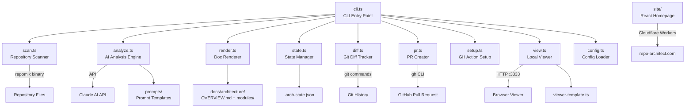
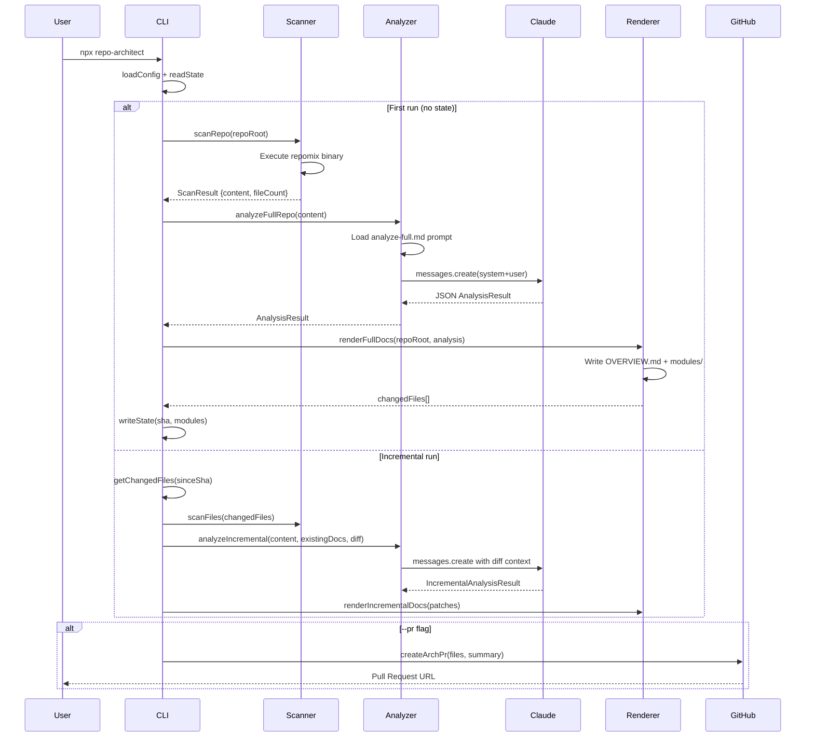
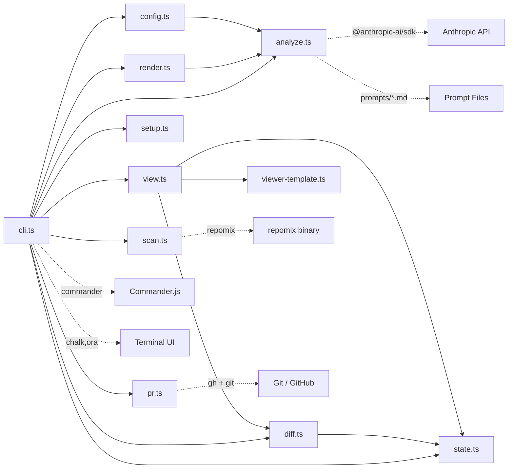

# repo-architect - Architecture Overview

> Auto-generated by repo-architect on 2026-02-19

## Overview

repo-architect is an automated architecture documentation generator that leverages Claude AI (Anthropic) to analyze codebases and produce comprehensive, living documentation. The tool scans repositories using repomix, sends the extracted content to Claude for structural analysis, and generates Markdown documentation with Mermaid diagrams — including system maps, data flows, dependency graphs, and per-module class diagrams. The output lives in `docs/architecture/` and renders natively on GitHub.

The system operates in two modes: full analysis for initial documentation generation, and incremental updates that only re-analyze when structural git changes are detected since the last run. This minimizes AI API costs on repos that change frequently. A state file at `docs/architecture/.arch-state.json` tracks the last commit SHA and module inventory to enable this diffing.

The CLI pipeline follows a clean scan → analyze → render → PR pattern. The `scan.ts` module wraps repomix to produce XML-format repo content, `analyze.ts` sends it to Claude with structured prompt templates, `render.ts` generates or patches Markdown files, and `pr.ts` automates branch creation and GitHub PR submission via the `gh` CLI. A local HTTP viewer (`view.ts`) serves an interactive Mermaid-rendered HTML page at port 3333.

The project also includes a marketing homepage (`site/`) built with React 19, Vite, and TailwindCSS v4, hosted on Cloudflare Workers. The `.agents/skills/` directory contains an extensive library of AI agent skill definitions (Mermaid, Remotion, browser automation, React best practices) used for agent-assisted development.

## Tech Stack

- TypeScript (ES2022, ESM)
- Bun runtime
- Node.js APIs (fs, http, child_process)
- Anthropic Claude API (@anthropic-ai/sdk)
- repomix (repository content extraction)
- Commander.js (CLI argument parsing)
- chalk + ora (terminal UI)
- Mermaid (diagram syntax)
- GitHub CLI (gh) for PR creation
- Git
- Vitest (unit testing)
- React 19
- Vite 6
- TailwindCSS v4
- lucide-react (icons)
- Cloudflare Workers (homepage hosting via wrangler)

## System Map

## Data Flows

## Dependency Graph

## Modules

| Module | Path | Description |
|--------|------|-------------|
| [CLI Entry Point](modules/cli-entry-point.md) | `src/cli.ts` | Main command-line interface built with Commander.js that orchestrates the entire scan → analyze → render → PR pipeline. Handles argument parsing, mode selection (full, incremental, dry-run, view, setup, export), cost estimation, and coordinates all other modules. |
| [AI Analysis Engine](modules/ai-analysis-engine.md) | `src/analyze.ts` | Interfaces with the Anthropic Claude API to analyze repository content and generate structured architecture documentation as JSON. Handles both full analysis and incremental delta updates, with robust JSON extraction including XML-tag fallback parsing. |
| [Repository Scanner](modules/repository-scanner.md) | `src/scan.ts` | Wraps the repomix binary to extract repository content into XML format suitable for sending to Claude. Supports both full repository scanning and targeted file scanning for incremental updates. |
| [Documentation Renderer](modules/documentation-renderer.md) | `src/render.ts` | Generates Markdown files with embedded Mermaid diagrams from analysis results. Handles full documentation generation and incremental patching of existing docs, preserving human-written content while replacing only changed sections. |
| [State Manager](modules/state-manager.md) | `src/state.ts` | Persists run state to `docs/architecture/.arch-state.json` to enable incremental updates. Tracks the last commit SHA, timestamp, and module inventory so the CLI can detect what changed between runs. |
| [Git Diff Tracker](modules/git-diff-tracker.md) | `src/diff.ts` | Analyzes git history to identify structural changes since the last documentation run. Classifies file changes as structural (requiring re-analysis) or ignorable (tests, docs, configs) to minimize unnecessary Claude API calls. Also provides architecture history snapshots. |
| [PR Creator](modules/pr-creator.md) | `src/pr.ts` | Automates the GitHub pull request workflow for documentation updates. Creates a timestamped branch, commits changed files, pushes to remote, and opens a PR using the `gh` CLI tool. |
| [Local Viewer](modules/local-viewer.md) | `src/view.ts + src/viewer-template.ts` | Interactive HTML documentation viewer served on localhost. Loads architecture docs from disk, injects them as JSON into a self-contained HTML template, and serves it with client-side Mermaid rendering, zoom/pan controls, sidebar navigation, and architecture history browsing. |
| [Config Loader](modules/config-loader.md) | `src/config.ts` | Loads per-repository configuration from `repo-architect.config.json`, applying defaults for output directory, ignore patterns, include patterns, and AI model selection. |
| [Marketing Site](modules/marketing-site.md) | `site/` | React 19 single-page marketing website for repo-architect.com, built with Vite and TailwindCSS v4. Features a hero with animated terminal, how-it-works section with live Mermaid diagram rendering, gallery, quick-start guide, and dark/light theme toggle. |
