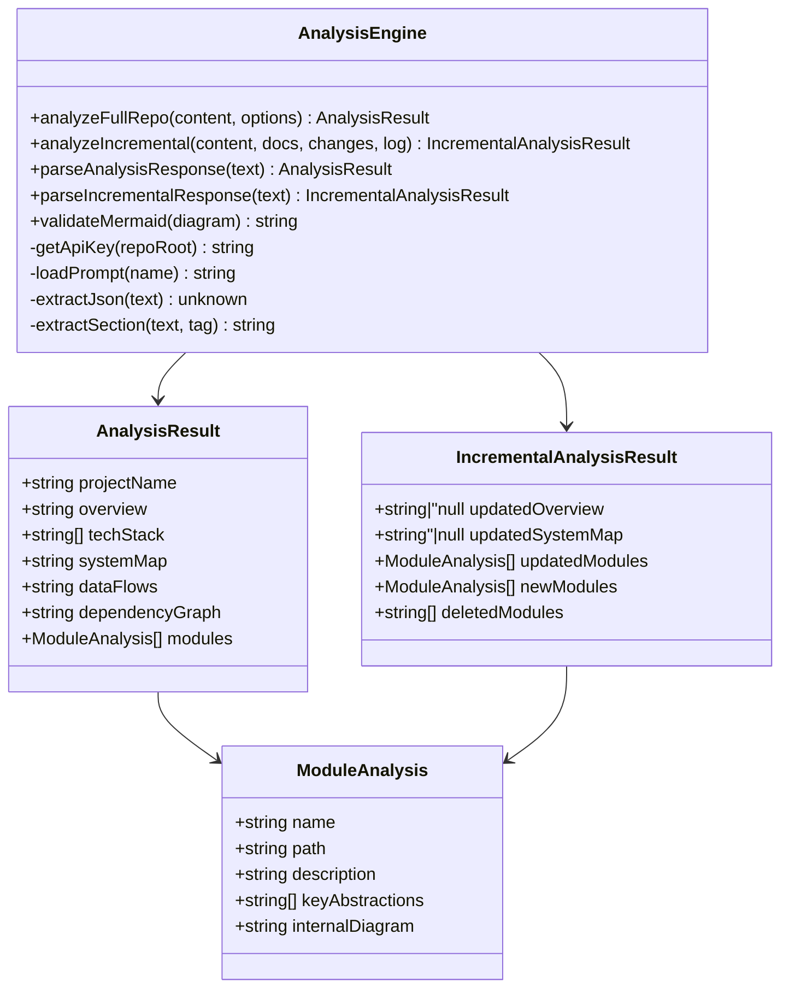

# AI Analysis Engine

> Path: `src/analyze.ts`

Interfaces with the Anthropic Claude API to analyze repository content and generate structured architecture documentation as JSON. Handles both full analysis and incremental delta updates, with robust JSON extraction including XML-tag fallback parsing.

## Key Abstractions

- AnalysisResult
- IncrementalAnalysisResult
- ModuleAnalysis
- TokenUsage
- AnalyzeOptions
- analyzeFullRepo(content, options)
- analyzeIncremental(content, existingDocs, changeSummary, gitLog, options)
- parseAnalysisResponse(text)
- parseIncrementalResponse(text)
- validateMermaid(diagram)
- extractJson(text)
- DEFAULT_MODEL

## Internal Structure

