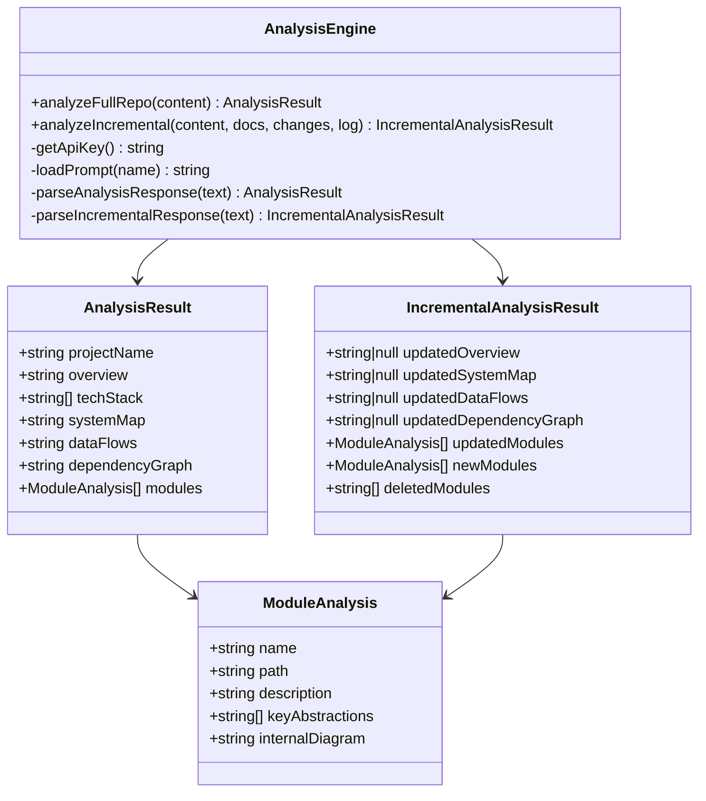

# AI Analysis Engine

> Path: `src/analyze.ts`

Interfaces with the Anthropic Claude API to analyze repository content and generate structured architecture documentation. Handles both full analysis and incremental updates, with robust JSON parsing including XML-tag fallback extraction.

## Key Abstractions

- AnalysisResult (project overview, diagrams, modules)
- IncrementalAnalysisResult (delta updates)
- ModuleAnalysis (per-module documentation)
- analyzeFullRepo(content): Promise<AnalysisResult>
- analyzeIncremental(content, docs, changes, log): Promise<IncrementalAnalysisResult>
- extractJson() with XML-tag fallback

## Internal Structure

