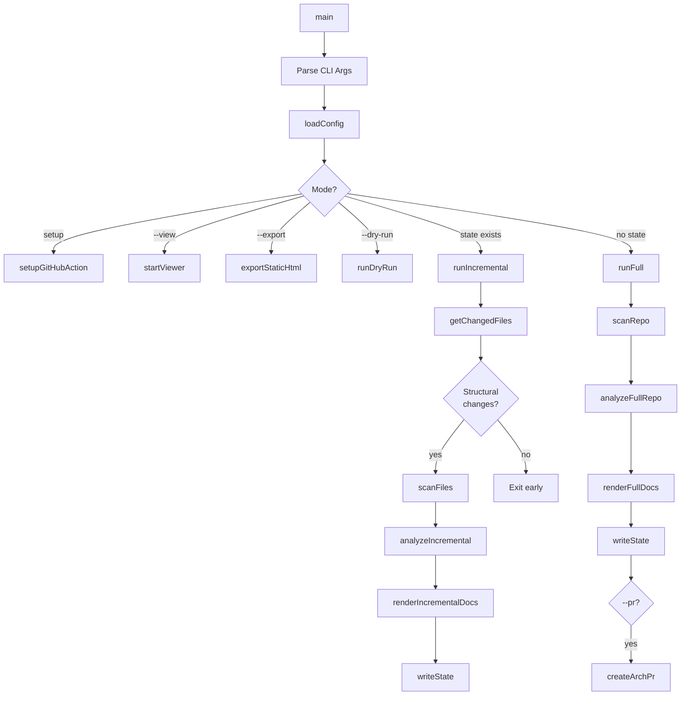

# CLI Entry Point

> Path: `src/cli.ts`

Main command-line interface built with Commander.js that orchestrates the entire scan → analyze → render → PR pipeline. Handles argument parsing, mode selection (full, incremental, dry-run, view, setup, export), cost estimation, and coordinates all other modules.

## Key Abstractions

- runFull(repoRoot, createPr, model, config)
- runIncremental(repoRoot, createPr, model, config)
- runDryRun(repoRoot, model, config)
- estimateCost(usage, model)
- formatUsage(usage, model)
- RepoArchitectConfig

## Internal Structure

