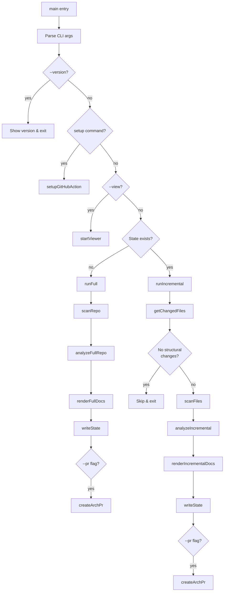

# CLI Entry Point

> Path: `src/cli.ts`

Main command-line interface that orchestrates the entire documentation pipeline. Handles argument parsing, mode selection (full vs incremental), and coordinates all modules to execute the scan-analyze-render-PR workflow.

## Key Abstractions

- Command (commander.js)
- runFull(repoRoot, createPr)
- runIncremental(repoRoot, createPr)
- main() orchestration function

## Internal Structure

