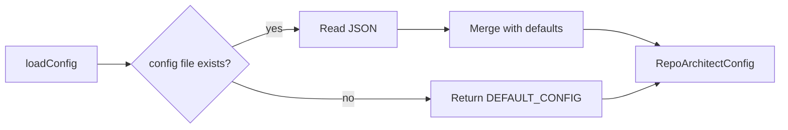

# Config Loader

> Path: `src/config.ts`

Loads per-repository configuration from `repo-architect.config.json`, applying defaults for output directory, ignore patterns, include patterns, and AI model selection.

## Key Abstractions

- RepoArchitectConfig { outputDir, ignore, include, model }
- DEFAULT_CONFIG
- loadConfig(dir): Promise<RepoArchitectConfig>
- createDefaultConfig(dir): Promise<string>

## Internal Structure

