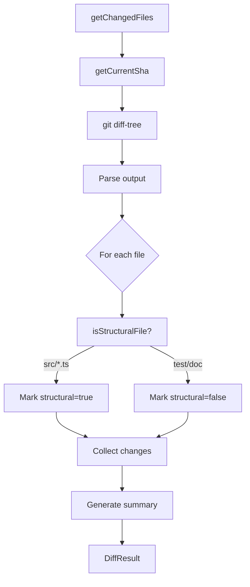

# Git Diff Tracker

> Path: `src/diff.ts`

Analyzes git history to identify structural changes since the last documentation run. Classifies changes as structural (requiring re-analysis) or ignorable (tests, configs, docs) to minimize unnecessary AI API calls.

## Key Abstractions

- StructuralChange { file, changeType, isStructural }
- DiffResult { changes, currentSha, summary }
- getChangedFiles(repoRoot, sinceSha): Promise<DiffResult>
- isStructuralFile(filepath): boolean
- getGitLogSummary(repoRoot, sinceSha): Promise<string>

## Internal Structure

