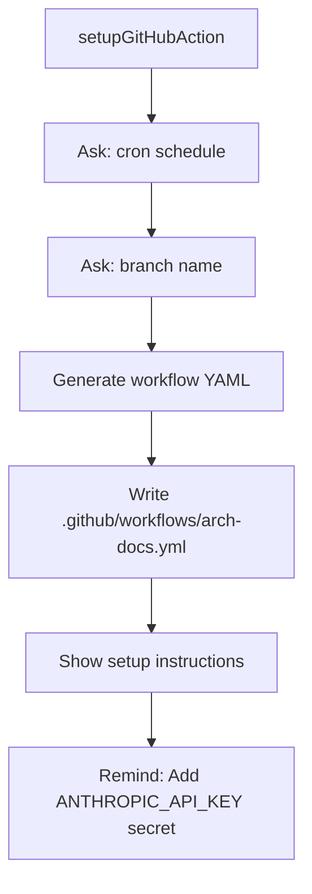

# GitHub Action Setup

> Path: `src/setup.ts`

Interactive setup wizard that generates a GitHub Actions workflow file for nightly documentation updates. Prompts for cron schedule and branch name, then creates `.github/workflows/arch-docs.yml`.

## Key Abstractions

- setupGitHubAction(repoRoot): Promise<void>
- ask(question): Promise<string>
- Workflow template with cron schedule
- ANTHROPIC_API_KEY secret requirement

## Internal Structure

