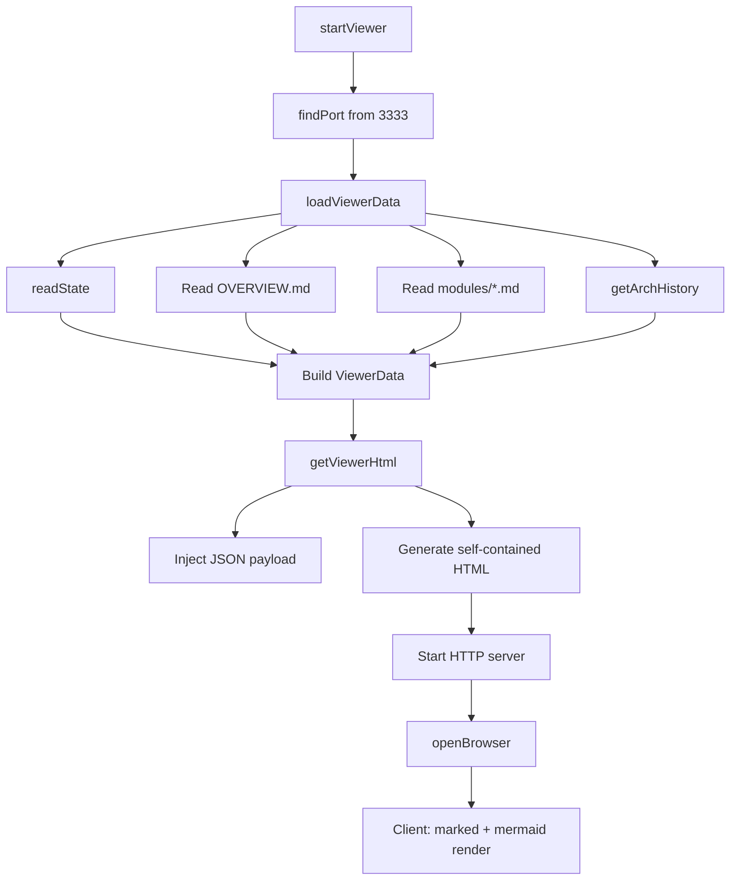

# Local Viewer

> Path: `src/view.ts + src/viewer-template.ts`

Interactive HTML documentation viewer served on localhost. Loads architecture docs from disk, injects them as JSON into a self-contained HTML template, and serves it with client-side Mermaid rendering, zoom/pan controls, sidebar navigation, and architecture history browsing.

## Key Abstractions

- ViewerData { projectName, overview, modules, lastRunAt, history }
- ViewerModule { name, slug, content }
- loadViewerData(repoRoot, outputDir?)
- getViewerHtml(data, options?)
- startViewer(repoRoot, port?, outputDir?)
- exportStaticHtml(repoRoot, outputPath?, outputDir?)
- slugify(name): string
- findPort(start): number

## Internal Structure

