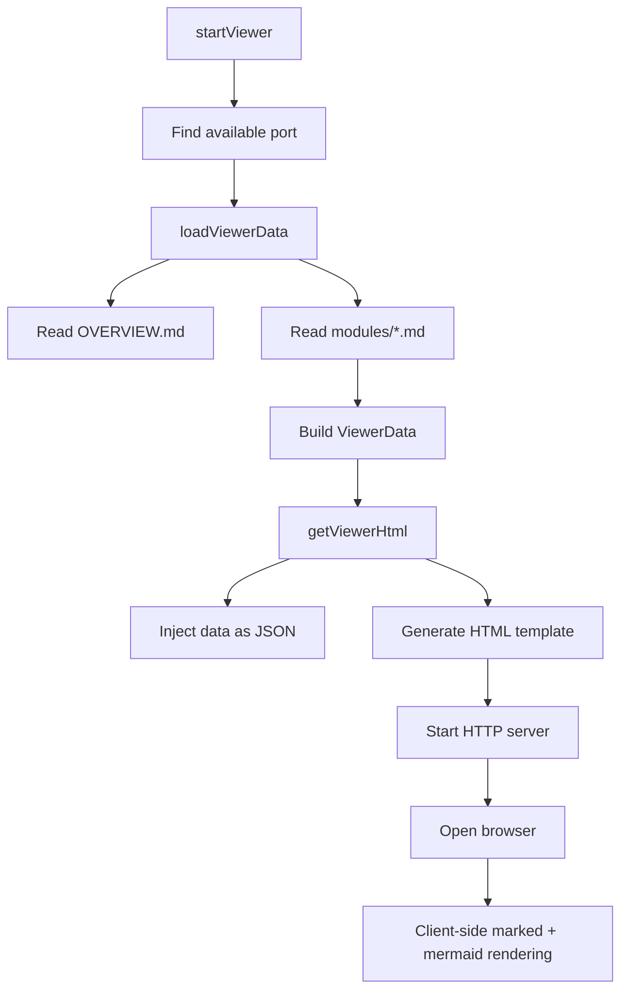

# Local Viewer

> Path: `src/view.ts + src/viewer-template.ts`

Interactive HTML documentation viewer served on localhost. Loads architecture docs, renders Mermaid diagrams client-side with zoom/pan controls, provides sidebar navigation, and features a dark theme for comfortable reading.

## Key Abstractions

- ViewerData { projectName, overview, modules, lastRunAt }
- ViewerModule { name, slug, content }
- loadViewerData(repoRoot): Promise<ViewerData>
- getViewerHtml(data): string
- startViewer(repoRoot, port?): Promise<void>
- HTTP server on port 3333 (or next available)

## Internal Structure

