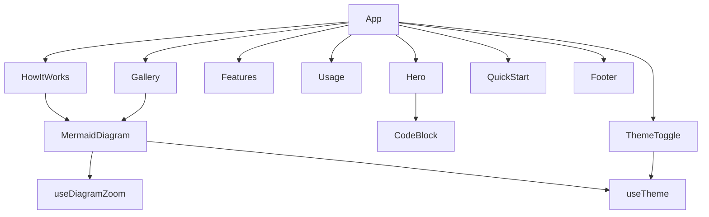

# Marketing Site

> Path: `site/`

React 19 single-page marketing website for repo-architect.com, built with Vite and TailwindCSS v4. Features a hero with animated terminal, how-it-works section with live Mermaid diagram rendering, gallery, quick-start guide, and dark/light theme toggle.

## Key Abstractions

- App (root component)
- MermaidDiagram (mermaid.js rendering with zoom/pan)
- useDiagramZoom (wheel + drag pan/zoom hook)
- useTheme (cookie-persisted dark/light toggle via useSyncExternalStore)
- Hero, Features, Gallery, HowItWorks, QuickStart, Usage, Footer
- CodeBlock (copy-to-clipboard with tabs)
- diagrams.ts (diagram source string constants)

## Internal Structure

