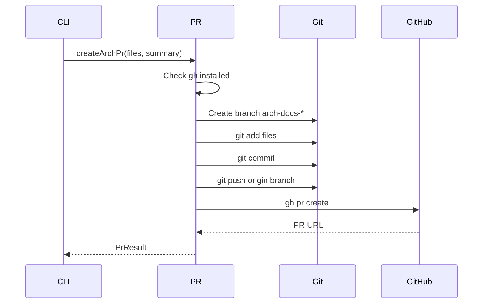

# PR Creator

> Path: `src/pr.ts`

Automates the GitHub pull request workflow for documentation updates. Creates a branch, commits changed files, pushes to remote, and opens a PR using the gh CLI tool.

## Key Abstractions

- PrResult { branch, prUrl }
- createArchPr(repoRoot, changedFiles, summary): Promise<PrResult>
- isGhInstalled(): Promise<boolean>
- Branch naming: arch-docs-YYYYMMDD-HHMMSS

## Internal Structure

