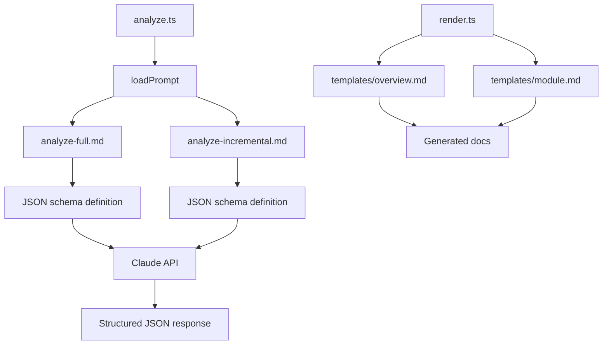

# Prompt Templates

> Path: `prompts/`

External Markdown prompt files for Claude AI that define the analysis instructions and JSON schema requirements. Separate files for full analysis and incremental updates ensure consistent, structured output from the LLM.

## Key Abstractions

- analyze-full.md - Initial repository analysis prompt with JSON schema
- analyze-incremental.md - Delta update analysis prompt
- templates/overview.md - OVERVIEW.md Markdown template
- templates/module.md - Per-module Markdown template

## Internal Structure

