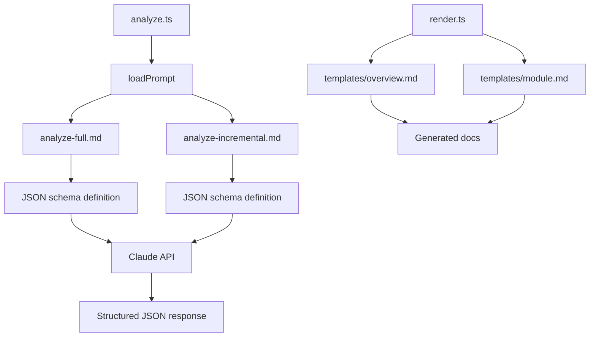

# Prompt Templates

> Path: `prompts/`

External prompt templates for Claude AI that define the analysis instructions. Separate files for full analysis and incremental updates ensure consistent, structured output from the LLM.

## Key Abstractions

- analyze-full.md - Initial repository analysis prompt
- analyze-incremental.md - Delta update analysis prompt
- templates/overview.md - Documentation template
- templates/module.md - Module documentation template
- JSON schema enforcement via prompts

## Internal Structure

