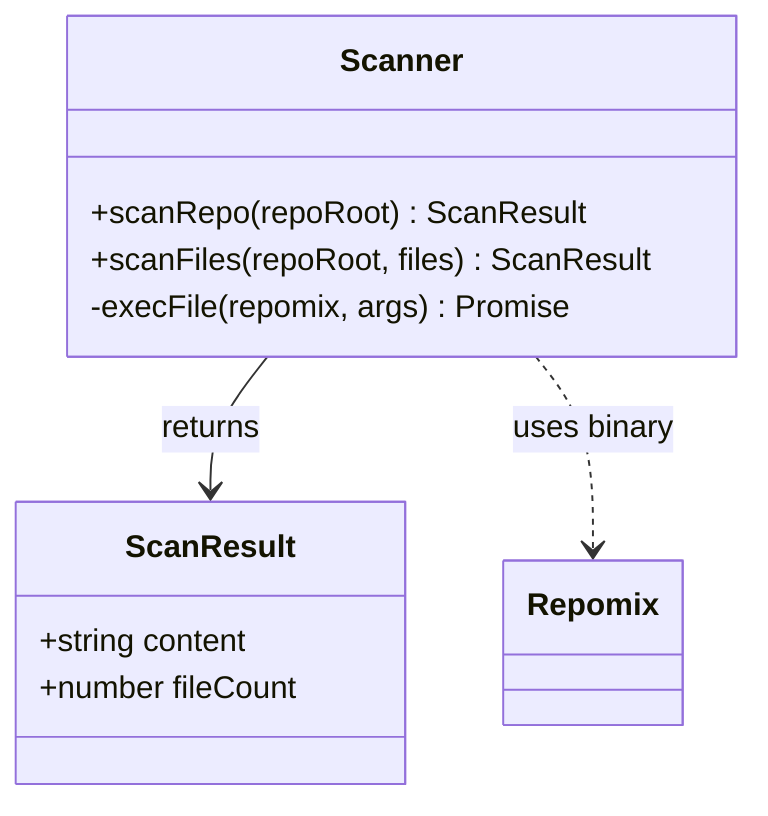

# Repository Scanner

> Path: `src/scan.ts`

Wrapper around the repomix binary that extracts repository content into XML format. Supports both full repository scanning and targeted file scanning for incremental updates.

## Key Abstractions

- ScanResult { content: string, fileCount: number }
- scanRepo(repoRoot): Promise<ScanResult>
- scanFiles(repoRoot, files[]): Promise<ScanResult>
- execFile with repomix binary

## Internal Structure

