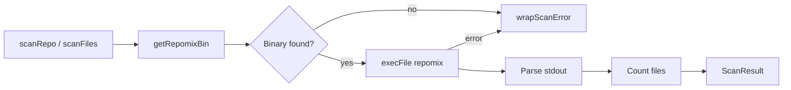

# Repository Scanner

> Path: `src/scan.ts`

Wraps the repomix binary to extract repository content into XML format suitable for sending to Claude. Supports both full repository scanning and targeted file scanning for incremental updates.

## Key Abstractions

- ScanResult { content: string, fileCount: number }
- ScanOptions { ignore?, include? }
- scanRepo(repoRoot, options): Promise<ScanResult>
- scanFiles(repoRoot, files[]): Promise<ScanResult>
- getRepomixBin(): string
- wrapScanError(err): Error

## Internal Structure

