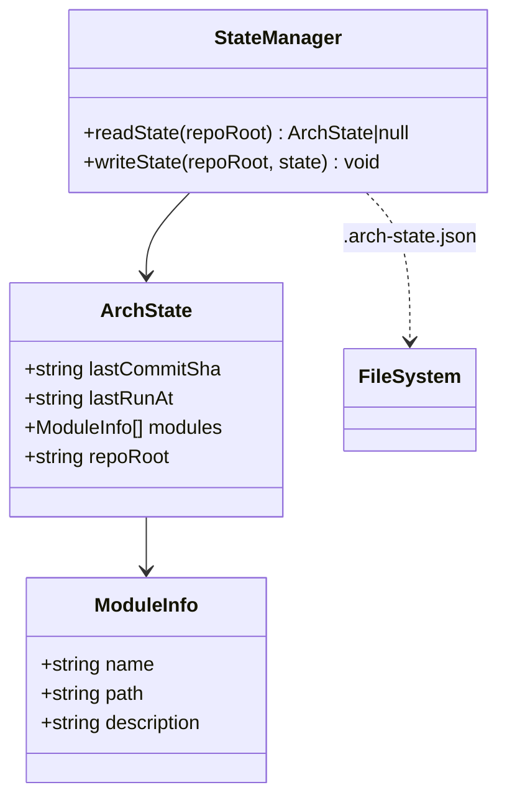

# State Manager

> Path: `src/state.ts`

Persists run state to enable incremental updates. Tracks the last commit SHA, timestamp, and module inventory to detect what has changed between runs.

## Key Abstractions

- ArchState { lastCommitSha, lastRunAt, modules, repoRoot }
- ModuleInfo { name, path, description }
- readState(repoRoot): Promise<ArchState|null>
- writeState(repoRoot, state): Promise<void>
- State file: docs/architecture/.arch-state.json

## Internal Structure

