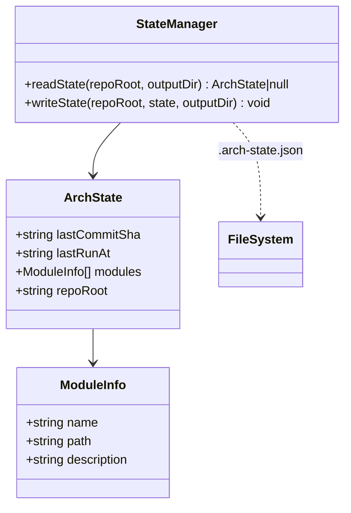

# State Manager

> Path: `src/state.ts`

Persists run state to `docs/architecture/.arch-state.json` to enable incremental updates. Tracks the last commit SHA, timestamp, and module inventory so the CLI can detect what changed between runs.

## Key Abstractions

- ArchState { lastCommitSha, lastRunAt, modules, repoRoot }
- ModuleInfo { name, path, description }
- readState(repoRoot, outputDir?): Promise<ArchState | null>
- writeState(repoRoot, state, outputDir?): Promise<void>

## Internal Structure

